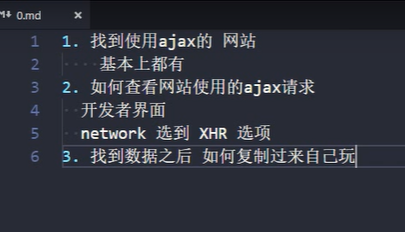

# PHP


## 设置编码格式

```php
header('content-type:text/html;charset=utf-8');
```


## echo

echo '输出的内容'；


## $定义变量

变量不以数字开头，分号不能省略

```php
$name = '吴京';
echo '$name';
```


## 拼接字符串

拼接字符串用.拼接


数组

```php
$foodArr = array('芒果','西兰花','鸡蛋');
echo $foodArr[2];
count($foodArr); //count()计算数组的长度
```


## 数组对象

```php
$person = array('name'=>'吴京','film'=>'战狼','wife'=>'谢楠');
echo $person['wife'];
print_r($person); //完整输出数组
echo '<br>'
//遍历
    foreach($person as key => $value){
        echo $key.'----'.$value.'<br>';
    }
```


## include

引入其他的php页面

```php
include 'fruit.php';
```


## $_Get()

超全局变量，$_Get('key');用于获取提交的数据


## get和post的区别

$_Get和$_Post

$_FILES;接受提交的文件


## 请求，响应

HTTP协议


具体步骤


get请求


回调函数


延迟数据


完整步骤


用户是否存在


添加提示信息


Post请求：要加上请求头，不能省略


## 获取JSON并解析

本质：Json的载体是字符串


返回对象：对象.属性

返回数组：循环


步骤


- 浏览器端

```javascript
document.querySelector('input').onclick=function(){
	//创建异步对象
	var xhr = new XMLHttpRequest();
	//设置请求行
	xhr.open("post",backJSON.php);
	//设置请求头（get请求可以省略）
	//注册状态改变事件（回调函数）
	xhr.onreadystatechange=function(){
	  //判断状态&请求是否成功并使用数据
	  if(xhr.readyState==4&&xhr.status==200){
	  console.log(xhr.responseText);
	  }
	}
	//发送请求
	xhr.send(null);
}
```

- 服务器端

```php
<?php
    //json也要设置一段内容
    //告诉浏览器返回的是json格式的数据，编码是utf-8
    header('content-type:application/json;charset=utf-8');
//读取JSON数据
    $jsonString = file_get_contents('data/stars.json');
//返回读取的内容
echo $jsonString;
?>
```

- 回调函数

```javascript
document.querySelector('input').onclick=function(){
	//创建异步对象
	var xhr = new XMLHttpRequest();
	//设置请求行
	xhr.open("post",backJSON.php);
	//设置请求头（get请求可以省略）
	//注册状态改变事件（回调函数）
	xhr.onreadystatechange=function(){
	  //判断状态&请求是否成功并使用数据
	  if(xhr.readyState==4&&xhr.status==200){
          //转化为对应的对象（数组）
	  var arr =  JSON.parse(xhr.responseText);
          console.log(arr);
          //遍历打印
          for(let i=0;i<arr.length;i++){
              let currentObj = arr[i];
              console.log('姓名：'+currentObj.name+'技能：'+currentObj.skill);
          }
	  }
	}
	//发送请求
	xhr.send(null);
}
```

- 回调函数渲染数据，html来渲染


## 获取网络请求

步骤：network->xhr->response




## ajax简化版

### post

- 第一个参数: page 访问的页面
- 第二个参数: {name:value} 提交的数据
- 第三个参数: function(){} 响应函数

```javascript
$.post(
    page,
    {"name":value},
    function(result){
        $("#checkResult").html(result);
    }
);
```

### get

- 第一个参数: page 访问的页面
- 第二个参数: {name:value} 提交的数据
- 第三个参数: function(){} 响应函数
- 只有第一个参数是必须的，其他参数都是可选

```javascript
$.get(
    page,
    {"name":value},
    function(result){
      $("#checkResult").html(result);
    }
);
```


## fetch

data.text()返回的是promise对象，所以后面用.then方法


参数


delete和get传参一样


post请求

