# ES6

JavaScript 的正式名称是 ECMAScript 。1996年11月，JavaScript 的创造者网景公司将 JS 提交给国际化标准组织 ECMA（European computer manufactures association，欧洲计算机制造联合会），希望这种语言能够成为国际标准，随后 ECMA 发布了规定浏览器脚本语言的标准，即 ECMAScript。这也有利于这门语言的开放和中立。

成为更好编写的开发语言有以下目标。

适应更复杂的应用；实现代码库之间的共享；不断迭代维护新版本。

js后面可以不加分号

当{【+-/五个符号之一时，前面加分号


## 严格模式

- IE10以上有作用
- 为某个函数开启严格模式，函数内部加入“use strict”
- 我们的变量名必须先声明后使用
- 我们不能随意删除已经声明好的变量
- `严格模式下全局作用域中函数的this是undefined`
- 在严格模式下，如果构造函数不加new调用，this会报错
- new实例化的构造函数指向创建的对象实例
- 定时器this还是指向window
- 事件和对象还是指向调用者
- 函数的变化
  - 不允许函数里面的参数有重名
  - 不允许非函数代码块里声明函数，必须放在最外层声明

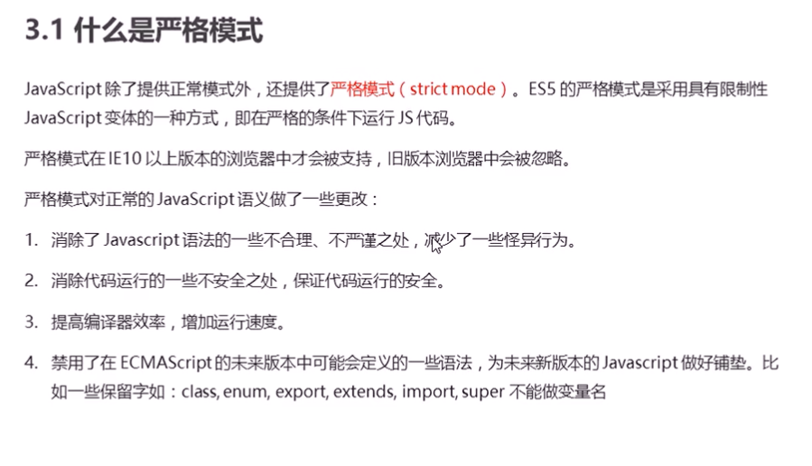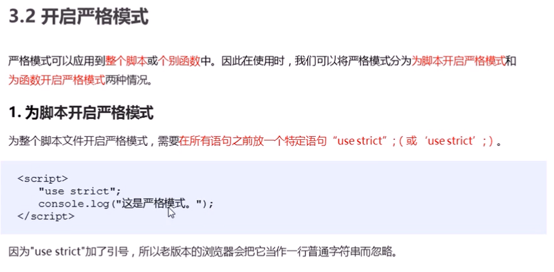

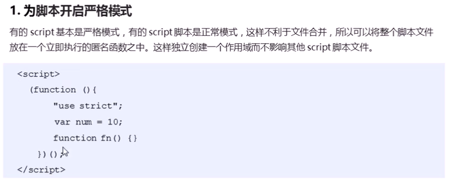


## let声明变量

- var 可以声明多次，var可以重复声明，无法限制修改，没有块级作用域
- let 只能声明一次
- let 声明的变量只在 let 命令所在的代码块内有效
- let具有暂时性死去特性
- ES6 明确规定，如果区块中存在`let`和`const`命令，这个区块对这些命令声明的变量，从一开始就形成了封闭作用域。凡是在声明之前就使用这些变量，就会报错。
- 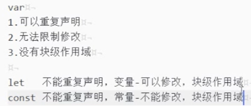

```javascript
let [a, b, c] = [1, 2, 3];
```


## const声明常量

- const 声明一个只读的常量，一旦声明，常量的值就不能改变
- const 声明一个只读变量，声明之后不允许改变。意味着，一旦声明必须初始化，否则会报错，对象时可以改变内部的属性

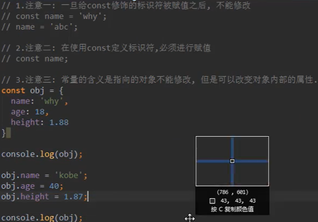

- 复杂数据类型，如array，object可以修改
  - ary[0]没错
  - ary = [1,2]重新赋值就错了

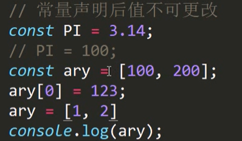


## 属性的增强

属性的增强写法，属性名和值相同时

直接写一个key即可


## Symbol数据类型

- ES6 数据类型除了 Number 、 String 、 Boolean 、 Object、 null 和 undefined ，还新增了 Symbol 
- Symbol ，表示独一无二的值，最大的用法是用来定义对象的唯一属性名
- 不能与其他数据进行计算，包括同字符串拼串
- for in，for of遍历时不会遍历symbol属性

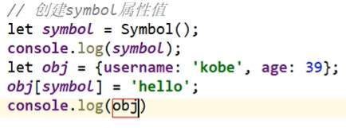

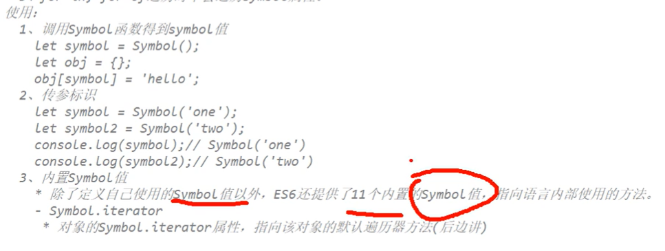


## 箭头函数

- 箭头函数中的this指向函数定义位置的上下文的this，此时的this指向obj

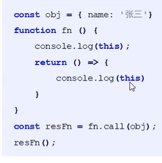

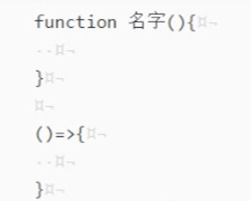

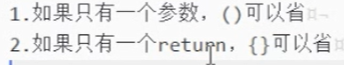

- 箭头函数里面没有this，所以指向最外层，当前对象

- 箭头函数的this指向父函数的this指向,即最近一层的this

- 对象里面的函数fun（）{}和fun:function(){}一个意思

- 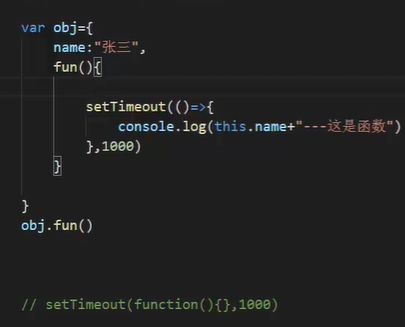

- 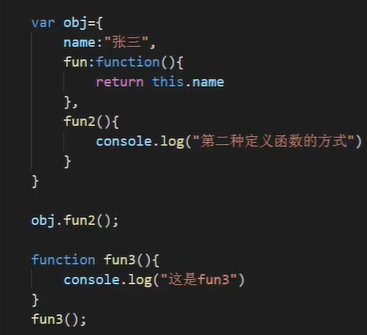

- 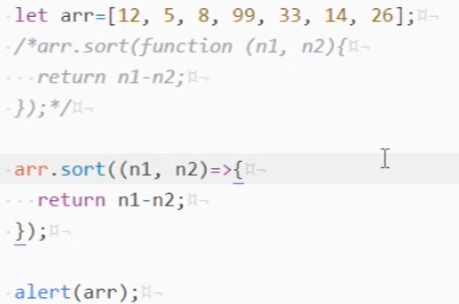

- ```javascript
  let show=function(a){
  	return a=a*2;
  }
  let show=a=>a*2;
  ```


经典面试题

- 箭头函数会改变this的指向，obj不能产生作用域，所以此时的this指向window

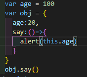


## 字符串模板

··包起来，&加变量名

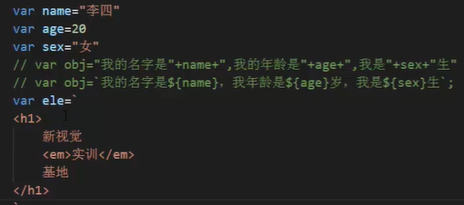


## 数组解构

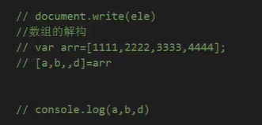


## 对象解构

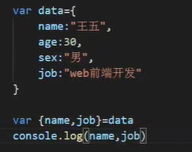


## 数组扩展

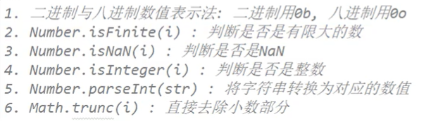

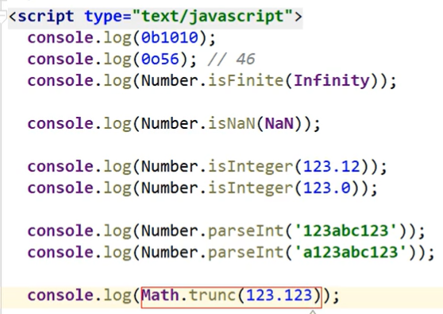


## 数组方法扩展

- Array.from(v)伪数组转换为真数组

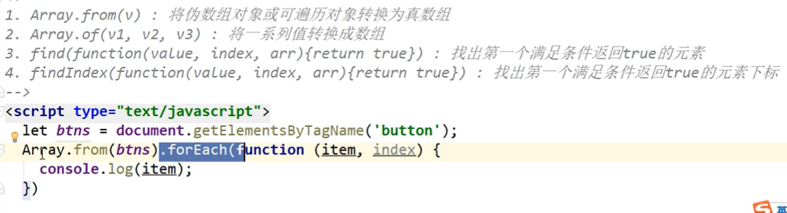

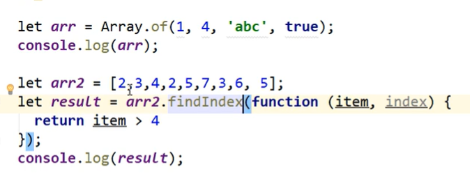


## find

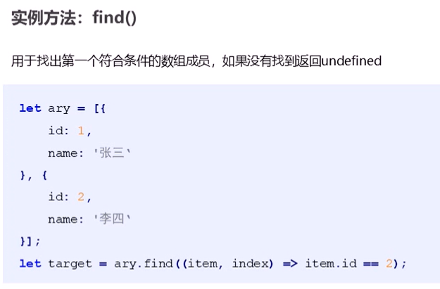


## findIndex

找到了返回1，没找到返回-1

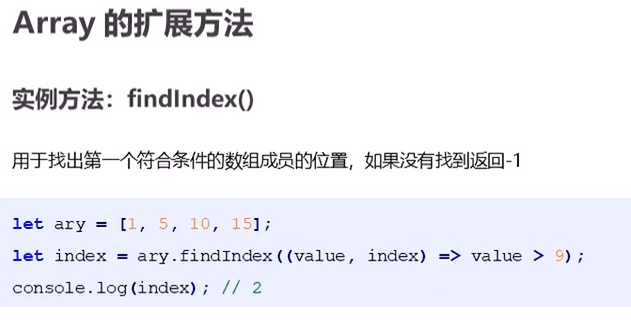


## 对象的扩展

- NaN与任何值都不相等
- Object.js(v1,v2)是通过字符串的方式去比较相等，下面的为false  true
- Object.assign，target为目标对象

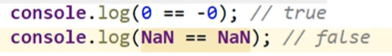

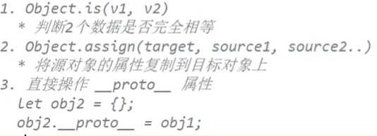

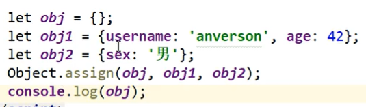

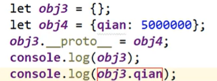


## 克隆

- 基本数据类型拷贝后修改不会生产新的数据
- 只有对象和数组才会有影响，最后打印的结果为wade和abcd
- 浅拷贝（对象/数组）拷贝的是引用，修改会影响原数据
- 深拷贝，拷贝的是新数据，修改不会影响原数据
- 浅拷贝只拷贝一层，更深层次对象级别的只拷贝引用
- 深拷贝拷贝多层，每一级别的数据都会拷贝

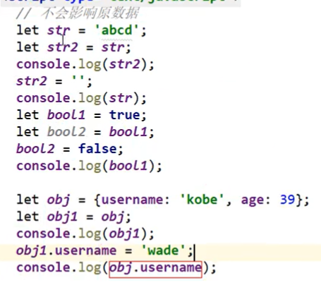

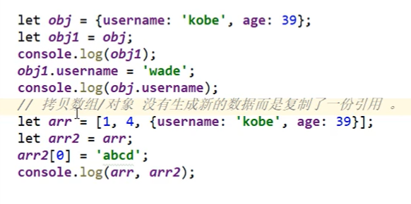

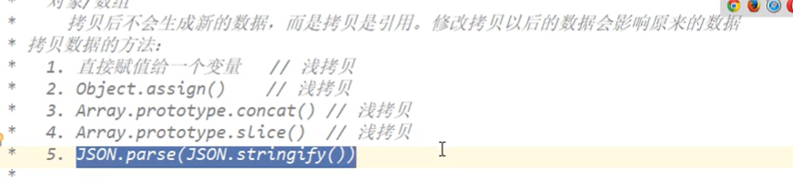

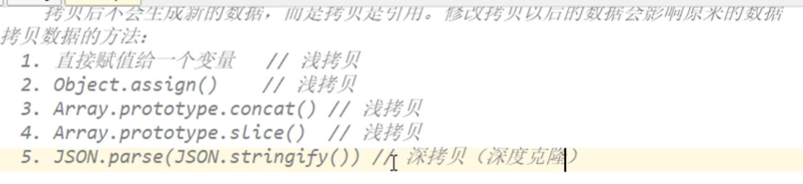

浅拷贝语法糖

- 第一个参数为拷贝的对象
- 第二个参数为被拷贝的对象

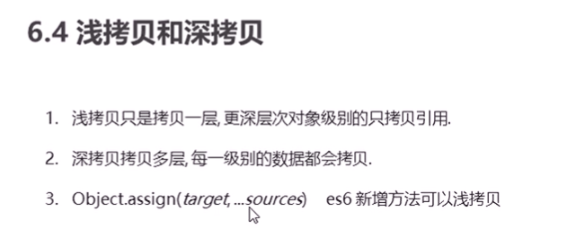


## Set

- Set数据结构，Set本身是一个构造函数

- 用于搜索历史关键字，数组去重

- 无序不可重复的多个value的集合体（数组）

- new一个Set，放一个数组，数组的每一项值不能相同，即set会自动去重

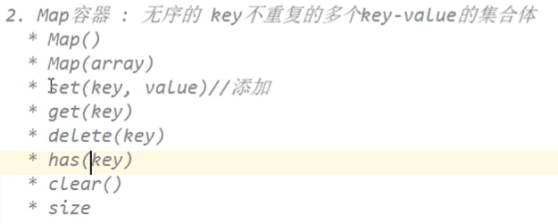

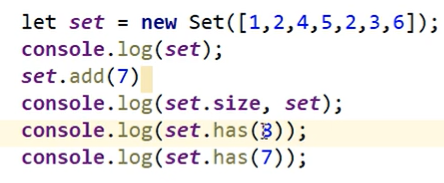

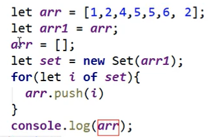


## Map

- 无序的key不重复的多个key-value的集合体

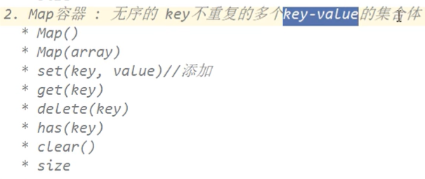

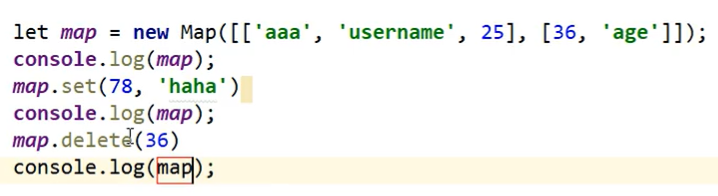


## for循环

forEach遍历

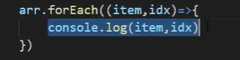

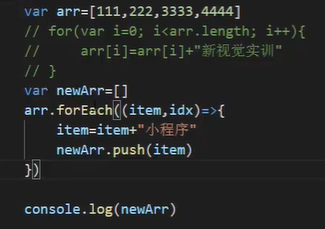

map遍历

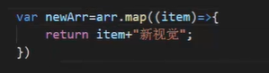

连接数组：...是展开字符，将数组展开运算

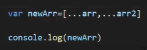


## promise封装请求

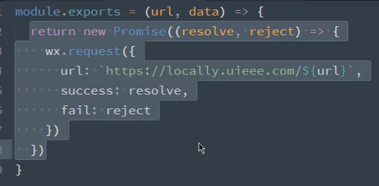

调用

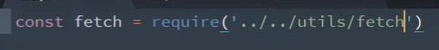

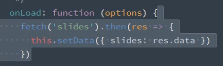


## 函数

- 参数扩展/展开数组

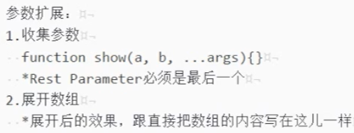

- 默认参数，传了参数就是传参的值，不传就为默认参数
- b默认为5，c默认为12

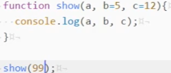


## 解构赋值

- 左右两边结构必须一样

- 右边必须是个东西
- 声明和赋值不能分开（初始化），必须在一句话里完成

```javascript
let [a,b,c]=[1,2,3];
let {a,c,d}={a:12,c:5,d:6};
let [{a,b},[n1,n2,n3],num,str]=[{a:12,b:5},[12,5,8],8,'abc'];
```

- {data:res}相当于data为res ，data=res


## 数组结构

- map 映射，用于总体的加减乘除

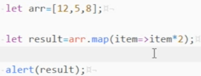

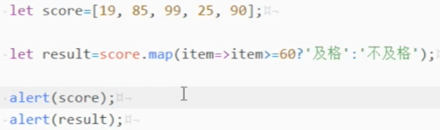

- reduce 汇总

  - tmp是中间体，即算数的中间体，初始为12
  - item为69
  - index为1，即指向开始的item

  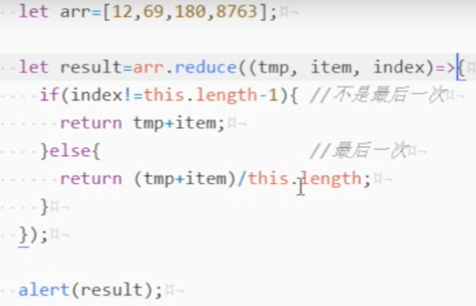

  - 函数后面的0为preValue的初始值，preValue为前面n的值

  

- filter 过滤器
  
  - 用于找到合适的数，相当于if
  - 返回的是bool值，返回为true的放到新的数组中
  
- 
  
  - 
  
- forEach 循环（迭代）
  
  - 


## 字符串

- 模板字符串${变量名}
- 模板字符串也可以调用函数


- starsWith方法，返回Boolean
  - 
- endsWith方法，返回Boolean
  - 
- repeat重复指定次数，ababababab


- 字符串模板
  - 字符串连接
    - 直接把东西塞到字符串里面$(变量)
    - 可以折行
  - 


## 面向对象

- class关键词，class里面直接加方法

- constructor构造器，构造器和类分开了

- 继承：
  - extends名字
  - 超类/父类super（）继承方法


## json

- json的标准写法

1. 只能用双引号
2. 所有的名字必须用引号包起来（key）

- JSON.stringify(变量)字符串化


- 字符串转json对象，JOSN.parse（变量名）


- 简写
  - 名字和值一样时只写一个


- json对象里面的函数fun（）{}和fun:function(){}一个意思，不用：function了


## Promise

- 异步：操作之间没啥关系，同时进行多个操作，代码更复杂


- 同步：同时只能做一件事，代码简单
- 步骤

单独的文件用来封装请求


相应的js页面引入


调用


## generator生成器函数

与promise一样解决异步编程

返回一个指针对象（遍历器对象）interator

不能写成箭头函数

要依赖于runner

用来函数暂停

*来声明，写哪里都可以

yield来控制函数的执行位置

next来调用函数哪部分的位置

调用一次next，执行a，调用两次，执行a，b


yield传参，下面的值为5，第一个next没法传参


yield返回，12为第一个res1的值，return出去的值给res2


异步操作

- promise一次读一堆
- generator适用于逻辑性


## Interator

（迭代器），是一种接口机制，为各种不同的数据结构提供统一的访问机制

- 是一个指针对象，遍历器对象，内部有一个next方法

- 为各种数据结构，提供一个统一的、简便的访问接口
- 使得数据结构的成员能够按某种次序排序
- ES6创造一种新的遍历命令for  of循环，Interator接口主要供for  of 消费


- 对象不能用for of遍历，因为没有interator
- 使用三点运算符合，解构赋值，调用到了interator接口
- 对象的Symbol.interator属性，指向遍历器对象


## 链式编程

多个函数之间的套用


## 模块化实现

每个js文件都是模块化，是一个独立的空间，script中加type="module"


导出方式一：

```javascript
export{
	flag,sum
}
```

导出方式二：

```javascript
export var num1 = 1000;
export var height = 1.88;
```

导出方式三：导出函数/类

```javascript
export function mul(num1,num2){
	return num1 * num2
}

export class Person{
    run(){
        consloe.log("在奔跑");
    }
}
```

导出方式四：export default只能导出一个(自定义导出)

```javascript
export default address
```

导入方式一：

```javascript
import {flag,sum} from "./aaa.js";
if(flag){
	console.log("小明是天才，嘿嘿嘿");
}
```

导入方式二：

```javascript
import {num1,height} from "./aaa.js";
console.log(num1);
console.log(height);
```

导入方式三：

```javascript
import {mul} from "./aaa.js";
console.log(mul(30,50));

const p = new Person();
p.run()
```

导入方法四：自定义导入，变量命名随意

```javascript
import addr from "./aaa.js";
```

统一全部导入

```javascript
import * as aaa from './aaa.js';
console.log(aaa.flag);
```

