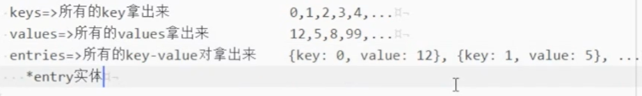

# 数组

## includes

- 数组是否包含某个东西

- 返回true or false

## keys/values/entries

keys得到索引，即0,1,2,3

values得到各个的值，12,5,8,99

entries(实体)得到一个个key-value，即0,12   1,5   2,8    3,99

## ES6容忍度

下面是正确的

## ES7容忍度

下面是正确的，函数的

# ES6中for of 和for in区别

## 循环数组

- for in循环下标key
- for of循环value

- for in得到的是索引，即0,1,2,3,4

- for of得到的是值，即12,5,8,99,31

# 幂

## 运算符简写

3的8次方

# 字符串

## padStart

- 从左到右拿字符，多的左补空格，下面的左边补7个空格

- 左边补0

## padEnd

- 从左到右拿字符，多的右补空格，下面的右边补7个空格