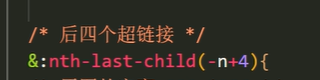
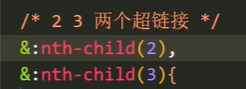
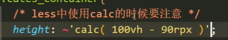

# HTML

Web前端开发所需要的硬知识其实都包含在三个标准里面：http标准、W3C标准和ECMA标准;


## 学习目标

HTML css js jq Ajax node.js vue  webpack

iview layui


## 网站

网站有多个网页组成，html为网页


## Web标准 ：遵守W3C标准 

1. 浏览器内核 safri：webkit ，chrome：bling
2. 使各浏览器相同样子显示


## Web的组成

1. 结构:html最重要
2. 表现:css
3. 行为:js


## Html

- html是超文本标记语言
- 超文本：图片，文字，视频等
- 标记语言，由标签组成


## Doctype 

文档类型声明(html的版本) 该文档为html5文档 不属于html结构


## lang

网页的语言lang：en网页为英文网页 zh-CH网页为中文网页


## charset

字符集编码charset：UTF-8万国码 存储html网页中的各文字（可以识别各种语言）


## vscode开发工具

- 插件 Chinese
- open in brown
- 
  auto tag


## p标签和br标签

p段落标签中间有间隙大,br换行 中间没间隙


## div,span

- div大盒子 块元素
- span小盒子 行内元素 之间小间隙


## h1-h6

h1到h6 字体加粗 越来越小


## strong,em,del,ins

- strong加粗
- em倾斜
- del删除
- ins下划线


## img图像属性

- src必写
- alt图片显示不出来则显示文字
- title鼠标放入图片文字提示
- width和height随便写一个，等比例缩放


## 上级目录../


## 绝对路径和相对路径


## a链接

- href等于#属性 target等于_self默认 _blank跳转页面

- 内部链接

- 外部链接

- 锚点链接id属性 

- 空链接#


## table表格

- 标签table tr行标签 th头单元格 td普通单元格

- 表格结构 thead表格头 tbody表格体

- 将tr th td 写入thead tbody中

- th加粗居中

  

## table表格属性

- align

- border等于1边框线

- cellpadding单元格和文字的距离

- cellsapcing等于0单元格之间的距离

- width

- height

  


## table表格合并

- td合并

- rowspacing以最上单元格开始 行合并

- colspacing以最左面的单元格开始 列合并

- 最后删除没有的单元格

  

## ul无序列表 ,ol有序列表

- ul li  ol li
- ul，ol中不可加任何标签，li可加任何标签


## dt自定义列表

- dt dh dd
- 一个头dh 下面是说明dd （独占一行）
- dt标签中只能是dt和dd
- dt和dd中可加任何标签
- 一般也会一个dt多个dd


## form表单

组成：表单域form、表单控件、提示文字


## form表单属性

- action
- method get或post
-  name表单名字


## form表单中的标签

- input
- textarea
- 
  select下拉框


## input属性

- type必须写
- type的值
- reset重置
- submit提交
- button
- text
- password密码框
- radio单选框 name的值必须相同才能多远1
- checkbox复选框 name值必须相同
- file
- placeholder提示值
- value默认值
- checked等于checked被选中
- maxlength最多


## label标签

- label与input一起用，增加用户体验
- label中for的值等于input的id值


## select标签

- select 至少有一个option
- 属性selected等于selected默认


## textarea文本框

- cols一行几个字
- rows有几行


## radio

设置name属性一样，使其只能选中一个


# CSS

CSS层叠样式表，标记语言


## CSS组成

- 选择器+样式
- 选择器：标签，类，id，通配符选择器


## font-family

font-family用英文，有空格加引号，中文加引号，英文不用，特殊的要考虑浏览器兼容问题


## font-weight

font-weight:400;不加粗，700加粗


## text-indent文本缩进

text-indent等于2em相对单位 ，相对父元素文字大小

text-indent等于字体的大小


## CSS三大特性

- 层叠性
- 继承性
- font：12px/1.5; 子元素当前文字大小的1.5倍行高
- 优先性
- 通配符0
- 类1
- id10
- 行内1000
- ！important最大


## table表格border-collapse

表格border-collapse等于collapse将相邻的边框合并在一起


## 行内元素

只能设置左右内外边距，上下无效


## boder-radius

- 等于50%就为宽度的一半（圆）
- 等于高度的一半就为矩形圆角


## box-shadow

- 水平 垂直 模糊程度 模糊尺寸 颜色

```css透明度
0 0 5px 5px rgba（0，0，0，.3）
```


## text-shadow

水平 垂直 模糊程度 颜色


## 网页的布局方式

- 标准流 浮动流 定位流
- 浮动具有行内块元素的特性，中间没缝隙


## clear清除浮动

在浮动标签后加一个块级标签进行清除浮动

```css
clear:both;
```

额外标签法

- w3c标准
- 给父元素添加overflow等于hidden
- 给父元素加一个：after伪类


## display:none和visibility: hidden的区别

- 说起visibility属性，很多人简单的认为display:none和visibility:hidden两个隐藏的区别就在于display:none隐藏后的元素不占据任何空间，而visibility:hidden隐藏的元素空间依旧保留。
- 对于一个display计算值是none的元素而言，该元素及其后代元素全部都被隐藏（请记住这个概念，等下对比下visibility的说法）。你可以认为当前元素从dom文档流中“消失了”，当然不是真正的消失，这个节点依旧存在于文档流中，因此vue中的v-show对应的是CSS的display值，而v-if则是彻底删除节点


## display:flex;弹性布局

https://www.w3cschool.cn/css3/2h6g5xoy.html

弹性容器外及弹性子元素内是正常渲染的。弹性盒子只定义了弹性子元素如何在弹性容器内布局。

弹性子元素通常在弹性盒子内一行显示。默认情况每个容器只有一行。


flex-direction 顺序指定了弹性子元素在父容器中的位置

- row：横向从左到右排列（左对齐），默认的排列方式。
- row-reverse：反转横向排列（右对齐，从后往前排，最后一项排在最前面。
- column：纵向排列。
- column-reverse：反转纵向排列，从后往前排，最后一项排在最上面。


justify-content 属性

内容对齐（justify-content）属性应用在弹性容器上，把弹性项沿着弹性容器的主轴线（main axis）对齐。

- flex-start：

  弹性项目向行头紧挨着填充。这个是默认值。第一个弹性项的main-start外边距边线被放置在该行的main-start边线，而后续弹性项依次平齐摆放。

- flex-end：

  弹性项目向行尾紧挨着填充。第一个弹性项的main-end外边距边线被放置在该行的main-end边线，而后续弹性项依次平齐摆放。

- center：

  弹性项目居中紧挨着填充。（如果剩余的自由空间是负的，则弹性项目将在两个方向上同时溢出）。

- space-between：

  弹性项目平均分布在该行上。如果剩余空间为负或者只有一个弹性项，则该值等同于flex-start。否则，第1个弹性项的外边距和行的main-start边线对齐，而最后1个弹性项的外边距和行的main-end边线对齐，然后剩余的弹性项分布在该行上，相邻项目的间隔相等。

- space-around：

  弹性项目平均分布在该行上，两边留有一半的间隔空间。如果剩余空间为负或者只有一个弹性项，则该值等同于center。否则，弹性项目沿该行分布，且彼此间隔相等（比如是20px），同时首尾两边和弹性容器之间留有一半的间隔（1/2*20px=10px）。


align-items 属性

设置或检索弹性盒子元素在侧轴（纵轴）方向上的对齐方式。

- flex-start：弹性盒子元素的侧轴（纵轴）起始位置的边界紧靠住该行的侧轴起始边界。
- flex-end：弹性盒子元素的侧轴（纵轴）起始位置的边界紧靠住该行的侧轴结束边界。
- center：弹性盒子元素在该行的侧轴（纵轴）上居中放置。（如果该行的尺寸小于弹性盒子元素的尺寸，则会向两个方向溢出相同的长度）。
- baseline：如弹性盒子元素的行内轴与侧轴为同一条，则该值与'flex-start'等效。其它情况下，该值将参与基线对齐。
- stretch：如果指定侧轴大小的属性值为'auto'，则其值会使项目的边距盒的尺寸尽可能接近所在行的尺寸，但同时会遵照'min/max-width/height'属性的限制。


flex-wrap 属性

用于指定弹性盒子的子元素换行方式。

- **nowrap** - 默认，弹性容器为单行。该情况下弹性子项可能会溢出容器。
- **wrap** - 弹性容器为多行。该情况下弹性子项溢出的部分会被放置到新行，子项内部会发生断行
- **wrap-reverse** -反转 wrap 排列。


align-content 属性

- `stretch` - 默认。各行将会伸展以占用剩余的空间。
- `flex-start` - 各行向弹性盒容器的起始位置堆叠。
- `flex-end` - 各行向弹性盒容器的结束位置堆叠。
- `center` -各行向弹性盒容器的中间位置堆叠。
- `space-between` -各行在弹性盒容器中平均分布。
- `space-around` - 各行在弹性盒容器中平均分布，两端保留子元素与子元素之间间距大小的一半。


## alpha通道与opacity属性的区别

在利用alpha通道设定透明度的时候需要单独对每一个设定，而opacity直接就运用在了整个标签上，其实这就是两者最大的区别，总结来说，opacity只能设定整个元素的透明值，而alpha通道可以特定对元素的某个属性设定透明值，比如上面的背景、边框、文字等

```css
div {  
    width: 100px;  
    height: 100px;  
    background: #000000;  
    border: 1px solid #000000;  
    opacity: 0.5;  
}  
```

```css
div {  
    width: 100px;  
    height: 100px;  
    background: rgba(0,0,0,0.5);  
    border: 1px solid #000000;  
}  
```


## 绝对定位和固定定位

绝对定位和固定定位加了之后，一定要指定宽width：100%；

加了固定定位，要给body加一个padding-botton：高度；


## 垂直居中

vertical-align:middle;


## Boostrap响应式布局

- 对父元素进行不同宽度的设备进行布局
- container->row->col  使用行列行列嵌套
- 
- 谁要清楚浮动就直接加一个属性clearfix
- 图片宽度100%
- a为行内元素，要改变a元素的大小，给a标签改为块元素
- max-width：100%；   logo图片不进行缩放


### 定义好各内容的布局

- 栅格系统自动的将父元素划定为12等份

- 小于12份则占不满container的宽度，则会有空白
- 如果大于12，则多出的另起一行显示


### 列排序，列偏移

- col-md-offset-数字，往右偏移
- col-md-push-数字，往右推
- col-md-pull-数字，往左拉

### 响应式工具

#### 隐藏


#### 显示


## 移动端布局


## em

相对于父元素的字体大小


## rem

相对于html的字体大小，通过rem实现不同设备的等比例缩放


## 媒体查询

@media可以针对不同的屏幕尺寸设置不同的样式,px不能省略,从小到大排

- ### 媒体类型

  - all所有
  - print打印机
  - screen 手机，电脑，ipad

- ### 关键字

  - and且
  - not非
  - only特指

- ### 媒体特性
  - 小括号包含
  - width
  - min-width
  - max-width

```css
@media screen and (max-width:800px){

}
```


## Less

Css的预处理语言，实现css没有的功能，如运算

后几个-n+4，后面4个元素

安装插件easy less


### less运算


后面四个元素



固定获取元素



单位不同时需要注意格式




## transform：translate

实现水平和垂直居中，实现弹窗居中

```css
.pop_box{
    .pop_con{  //内容
        position: fixed;
        top: 50%;
        left:50%;
        transform: translate(-50%,-50%);
        -webkit-transform:translate(-50%,-50%);
    -moz-transform:translate(-50%,-50%);
        width:300px;
        height:300px;
        background-color: #fff;
        z-index: 99;
    }
    .pop{  //背景颜色
        width:100%;
        height:100%;
        position: fixed;
        top: 0;
        left:0;
        background-color: #000;
        opacity: 0.3;
        z-index: 90;
    }
}
```

```css
.content {
     padding:10px;
     background:green;
     color:#fff;
     position:absolute;
     top:50%;
     left:50%;
     border-radius: 5px;
     -webkit-transform: translate(-50%,-50%);
     -moz-transform: translate(-50%,-50%);
     transform:translate(-50%,-50%);
 }
```


## input去除边框

```css
input{
outline:none;
border:none;
}
```


## textarea去拉伸

```css
textarea{
resize:none;
}
```


## 溢出隐藏滚动条

```css
.inContainer {
   height:300px;
   width: 350px;
   overflow-x:hidden;
   overflow-y:scroll;
   scrollbar-width: none; 
}
/* 使用伪类选择器 ::-webkit-scrollbar ,兼容chrome和safari浏览器 */
.inContainer::-webkit-scrollbar{
    display: none;
}
```


## 弹窗

```less
// 弹窗
.pop_box{
      .pop_con{  //内容
          position:fixed;
          top:50%;
          left:50%;
          transform: translate(-50%,-50%);
          width:300px;
          height:300px;
          background-color: #fff;
          z-index: 99;
  .content {
    padding:10px;
    background:green;
    color:#fff;
    position:absolute;
    top:50%;
    left:50%;
    border-radius: 5px;
    -webkit-transform: translate(-50%,-50%);
    -moz-transform: translate(-50%,-50%);
    transform:translate(-50%,-50%);
}
      }
        .pop{  //背景颜色
          width:100%;
          height:100%;
          position: fixed;
          top: 0;
          left:0;
          background-color: #000;
          opacity: 0.3;
          z-index: 90;
      }
  }
```


## 图片滤镜

值越大越模糊，filter:blur(5px)


## 无缝连接

过渡效果以同样的速度从开始到结束：

```css
transition-timing-function: linear;
-webkit-transition-timing-function: linear; /* Safari and Chrome */
```


## 图片发亮效果

```html
<figure>
	
</figure>
```

```css
.hover14 figure {
	overflow: hidden;
	position: relative;
}
/*点击图片效果end*/

/*图片发亮效果start*/
.hover14 figure::before {
	position: absolute;
	top: 0;
	left: -75%;
	z-index: 2;
	display: block;
	content: '';
	width: 50%;
	height: 100%;
	background: -webkit-linear-gradient(left, rgba(255,255,255,0) 0%, rgba(255,255,255,.3) 100%);
	background: linear-gradient(to right, rgba(255,255,255,0) 0%, rgba(255,255,255,.3) 100%);
	-webkit-transform:skewX(-17deg);
	-moz-transform: skewX(-17deg);
	-o-transform: skewX(-17deg);
	-ms-transform: skewX(-17deg);
	transform: skewX(-17deg);
}
.hover14 figure:hover::before {
	-webkit-animation: shine .95s;
	-moz-animation: shine .95s; 
	animation: shine .95s;
}
```

