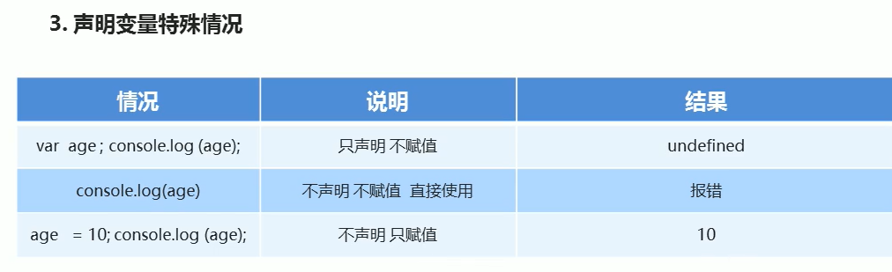
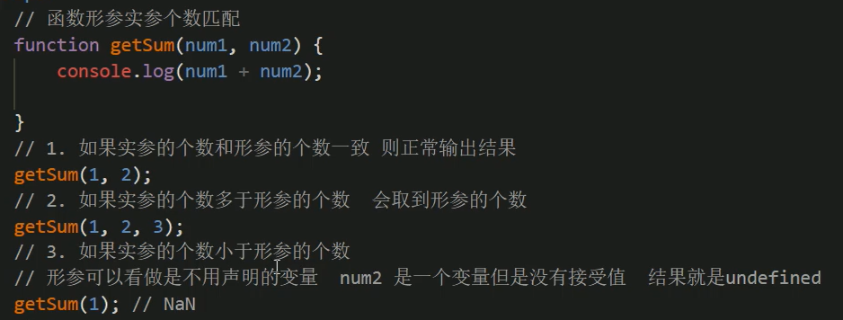

# 浏览器

浏览器分成两部分：渲染引擎和JS引擎

- 渲染引擎：用来解析HTML与CSS，俗称内核，比如chrome浏览器的blink，老版本的webkit
- JS引擎：也称为JS解释器。用来读取网页中JavaScript代码，对其处理后运行，比如chrome浏览器的V8

> 浏览器本身并不会执行JS代码，而是通过内置JavaScript引擎（解释器）来执行JS代码。JS引擎执行代码时逐行解释每一句源码（转换为机器语言），然后由计算机去执行，所以JavaScript语言归为脚本语言，会逐行解释执行。


# JS的组成

JS由ECMAScript、DOM（文档对象模型）、BOM（浏览器对象模型）


# 变量

- 变量的命名：字母、数字、下划线、美元符号（$）组成
- var app和var App是两个变量
- 不能以数字开头
- 不能是关键字var、for、while
- 遵守驼峰命名法:首字母小写，后面单词的首字母大写。myFirstName
- 尽量不要使用name做变量名，特殊的




# 数据类型

## Number

- Number.MAX_VALUE数字型的最大值
- Number.MIN_VALUE数字型的最小值
- Infinity无穷大
- -Infinity无穷小
- NaN非数值
- isNaN（）判断是否为非数字

## String

- 内双外单，内单外双
- length
- 只要有字符串和其它类型进行拼接，依旧为字符串。12+'12' -------->1212

## Boolean

- true为1，false为0

## Undefined

- 一个变量声明未赋值，就是undefined未定义数据类型
- 和数字相加，结果为NaN

## Null

- 空值

- 和数字相加为数字，null+1=1


# typeof

- 检测数据类型typeof num
- 特殊的typeof null数据类型为object


# 数据类型转换

- 转换为字符串
  - toString（），num.toString（）
  - String（）强制转换，String（num）
  - 加号拼接字符串
- 转换为数字型
  - parseInt（）   ----------parseInt（'120px'）输出120，   parseInt（'rem120px'） 输出NaN
    - 首字符必须为小数才是数字型
  - parseFloat（）
  - Number（str）强制转换
  - 隐式转换，利用了算数运算- * /
    - '20'-0
- 转换为布尔型Boolean（）
  - 代表空、否定的值会被转换为false，如''、0、NaN、null、undefined
  - 其余值都会被转换为true


# 符号

- ==有默认转换数据类型，会把字符串类型转换为数字类型 18=='18' 为true
- ===要求两测的值和数据类型一致，18==='18'为false


# 逻辑运算符

>如果有空的或者否定的为假，其余是真的   0，''，null，undefined，NaN

- 逻辑与短路运算：如果表达式1结果为真，则返回表达式2，如果表达式1为假，则返回表达式1

```javascript
console.log(123&&456) //456
console.log(0&&456) //0
```

- 逻辑或短路运算：如果表达式结果为真，则返回表达式1，如果表达式1为假，则返回表达式2

```javascript
console.log(123||456) //123
console.log(0||456) //456
```


# 运算符优先级


# swith

- 条件与case===
- 每个case要break
- 默认default


# for

- 外循环行，内循环列
- 外层执行 一次，里层执行全部

冒泡排序（从小到大）

- 外循环管趟数 i<=arr.length-1
- 内循环管每趟的交换次数 j<=arr.length-i-1

## 九九乘法表

```javascript
var str = ''
    for(var i=1;i<=9;i++){
      for(var j=1;j<=i;j++){
        str += j + 'x' + i +'='+ i * j + '\t'
      }
      str += '\n'
    }
    console.log(str)
```


# 数组

数组中可以存放任意类型的数据，例如字符串，数字，布尔值等，var arr = 1,2,'abc',true]


# 函数

- return 有多个值，则返回最后一个值为准
- 如果没有return，则返回undefined




## 检测是否为数组：Array.isArray优于instanceof


## 数组去重


## 数组转换为字符串

- join()，默认以逗号分隔
- toString()


# 作用域链

就近原则，一层一层向上查找


# 预解析

- js引擎运行js分为两步：预解析、代码执行

- 预解析js引擎会把js里面所有的var还有function提升到当前作用域的最前面
- 预解析分为变量提升和函数提升
- 变量提升：把所有的变量声明提升到当前的作用域最前面，不提示赋值操作
- 函数提升：把所有的函数声明提升到当前的作用域最前面，不调用函数，赋值的函数没有提升

> 注意：变量赋值了没有声明，当全局变量看

下面99999报错


# 对象

- var obj = {}

- var obj = new Object()

- 构造函数创建对象，构造函数的名字首字母大写，不需要return就可以返回结果

  ```javascript
  function 构造函数名(){
    this.属性 = 值
    this.方法 = function(){}
  }
  new 构造函数名()
  ```

- 调用对象：
  - 对象名.属性名
  - 对象吗['属性名']
  - 对象名.方法（）


# 内置对象

Math.round(-1.5) 为-1  ，因为.5特殊，它往大的取


# Date

- 参数常用写法
  - 数字型2019，10，01
  - 字符串型'2019-10-1 8:8:8'
- 月的索引从0开始，星期的索引从星期日为0


获取距离1970年1月1号过了多少毫秒数


倒计时


倒计时函数

