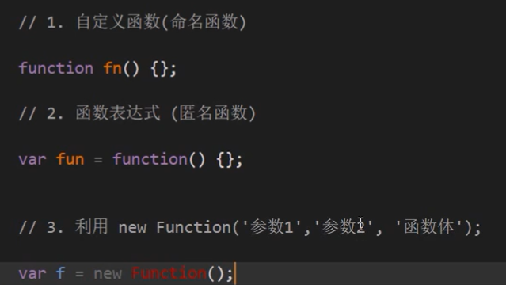
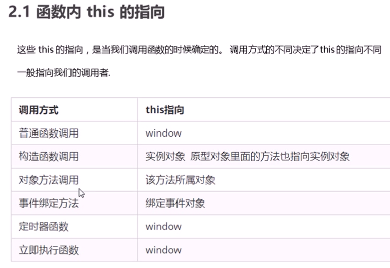
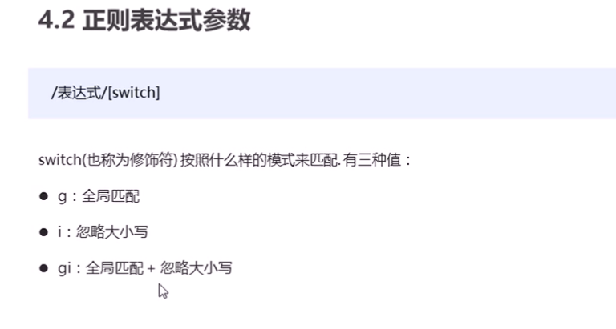

## arguments

- 伪数组，即没有数组的一般方法，必须要有length，Array.from可以将其转为真数组


- 里面存储了所有传递过来的实参，即不用写形参
- 展示形式是一个伪数组，即没有真正数组的一些方法，如push（），pop（）等
- 1,4,5，abc


## 匿名函数

var 变量名 = function(参数){};

```javascript
var fun = function(参数){
	console.log('我是函数表达式');
}
fun(参数);
```


## 全局变量，局部变量

特殊：在函数内部没有声明直接赋值的变量也称为全局变量

函数的形参是局部变量

全局变量：只有在浏览器关闭时才会销毁，比较占内存

局部变量：当代码运行完后就会被销毁，更节省内存空间


## Var

用var声明的变量或者函数，指提升变量的声明即var num；var fn；

自定义函数的声明也会提升其作用域，是整个函数提升


## 构造函数

- 构造函数名首字母必须大写

- 构造函数不需要return就可以返回结果

- 调用函数返回的是一个对象

- 构造函数的语法格式

function 构造函数名（）{

​	this.属性 = 值；

​	this.方法 = function(){}

}

调用:new 构造函数名(); 

```javascript
//构造函数,类似于java语言的类（抽象的）
function Star(uname,age,sex){
	this.name=uname;
    this.age=age;
    this.sex=sex;
    this.sing=function(sang){
        console.log(sang);
    }
}
//对象，通过new创建对象的过程我们也称对象实例化
var ldh = new Star('刘德华',18,'男');
console.log(ldh.name);
console.log(ldh.['sex']);
ldh.sing('冰雨');
```


## for in遍历

for in 遍历对象

```javascript
var obj	= {
	name:'pink老师',
	age:18,
	sex:'男'
}
for(var k in obj){
	console.log(k); //变量输出得到的是属性名
	console.log(obj[k]); //obj[k]得到的是属性值
}//写for in 里面的变量常用k或key
```


## 对象

对象分为三种，自定义对象，内置对象，浏览器对象

自定义对象var obj = {}；

内置对象是JS语言自带的一些对象，并	提供了常用的属性和方法（帮助我们快速开发）


## Math方法

是一个内置对象方法

Math.abs()；绝对值

Math.floor()；向下取整

Math.ceil(); 向上取整

Math.round();四舍五入


Math.random();返回一个随机的小数[0,1) 


## Date

Date是一个构造函数，需要new一下，只有月份的索引从零开始，返回的月份小一个月，周日返回的是0

使用Date,没有参数返回系统的当前时间

```javascript
var date = new Date(); //没有参数返回系统的当前时间
console.log(date);
```


获取当前时间距离1970年1月1日过了多少毫秒数（时间戳）

- date.valueOf();

- date.getTime();
- var date1 = +new Date(); console.log(date1); 常用
- H5: console.log(Date.now()); 常用


## 数组


### 检测是否为数组的方法


### 添加数组元素的方法

在末尾添加一个元素push()；方法      arr.push(参数); 返回的是新数组的长度

在末尾的开头添加一个元素unshift();  arr.unshift(参数); 返回的是新数组的长度

### 删除数组元素

删除数组的最后一个元素pop(); 返回的是删除数组的元素

删除数组的第一个元素shift(); 返回的是删除数组的元素

### 数组排序

reverse(); 反转数组

sort(); 冒泡排序（从小到大排序）只能排序个位数

解决方案

```javascript
var arr= [13,4,77,1,7];
arr.sort(function(a,b){
	return a-b; //升序的排序  降序则b-a;
});
```


## indexOf（）;方法

返回数组元素的索引号，返回满足数组元素第一个的索引号，索引从0开始，找不到则返回-1

lastIndexOf(); 从后往前找，找不到则返回-1


## join()

把数组转换为字符串

join(''分隔符");把数组中的所有元素转换为一个字符串

toString(); 把数组转换为字符串，逗号分隔每一项


## 基本包装类型


## charAt()

charAt(index);根据位置返回字符，遍历所有字符


charCodeAt(index);返回相应索引的ASCII值，判断用户按下了哪个键

str[index]; H5新增的，根据位置返回字符


## substr()

substr（'截取的起始位置','截取几个字符'）；


## replace()

replace('被替换的字符','替换的字符');   只替换第一个字符


## split()

把字符串转换为数组，split('分隔符');


## toUpperCase()

转换大写


## toLowerCase()

转换小写


## 基本数据类型

string，undefine，null，number，boolean（存储在栈中）   **注：函数调用时值传递**

null返回的是一个空的对象


## 复杂数据类型

通过new关键词创建对象，如Object，Array，Date（存储在堆中） **注：函数调用时传地址**


## 获取Dom


## 构造函数

- 构造函数+原型实现面向对象编程

- 构造函数有原型对象prototype
- 构造函数原型对象prototype里面有constructor指向构造函数本身
- 构造函数可以通过原型对象添加方法
- 构造函数创建的实例对象有`__pro__`原型指向构造函数原型对象
- ES6中的类也有这些特点，是构造函数的语法糖


## 原型链

原型的作用：共享方法（prototype）


## Object.defineProperty


## 函数的定义




## 函数this的指向

- call可以调用函数，如fn.call()直接调用函数，
  - fn.call(this)可以改变函数this的指向

- 立即执行函数，不用调用函数，自动执行

```javascript
(function(){
    
})()
```




## call

- 调用函数
- 改变this的指向
- 第一个参数为改变函数的this


- 主要作用：实现继承


## apply

- 第一个参数可以为空，null
- 第二个参数为数组
- 主要作用：操作数组，借助于数学对象实现数组最大值最小值


## bind

- 不会调用函数
- 修改完会产生一个新函数
- 主要作用：不调用函数改变this指向，改变定时器内部的this指向


## 高阶函数

- 传递的参数为函数
- 函数return返回的是一个函数
- 调用


## 闭包

指有权访问另一个函数作用域中变量的函数，被访问的变量的函数称为闭包函数

- 点击li输出索引号

- let
- 箭头函数
- bind改变this指向

onclick是异步的，for是同步的

立即执行函数也称为小闭包，因为立即执行函数里面的任何一个函数都可以使用它的i这个变量


闭包：闭包函数外可以访问到闭包内的变量

闭包的主要作用：延伸了变量的作用范围


定时器


## 递归

- 如果一个函数在内部可以调用其本身，那么这个函数就是递归函数
- 防止栈溢（死循环），出可以加个return


## 正则表达式

正则表达式是用于匹配字符串中字符组合的模式，在JS中，正则表达式也是对象

- 验证表单
  - 邮箱 `^\w+([-+.]\w+)*@\w+([-.]\w+)*\.\w+([-.]w+)*$`
  - 用户名 `/^[a-z0-9_-]{3,16}$`
- 过滤掉页面内容中的一些敏感词（替换）
- 字符串中获取我们想要的特定部分（提取）等


边界符

- 正则表达式里面不需要加引号

- `^`表示匹配行首的文本（以谁开始）
- `$`表示匹配行尾的文本（以谁结束）
- `[]`匹配符,只要匹配其中`一个`就可以了
  - 如果中括号里面有^表示取反的意思
- `-`范围符
- `|`或者符号
- `/^[a-zA-Z0-9]$/`字符组合，只能输入26个字母和数字

- /^abc$/，精确匹配，要求必须是abc字符串才符合规范
- /[abc]/，只要包含有a，或者b，或者c，都返回为true
- /^[\u4e00-\u9fa5]{2,8}$/，中文汉字2-8位
- /^\d{6}$/短信验证码
- 量次符，放在后面，{}中间不要有空格
  - a{3，}a出现大于等于3
  - a{3,6}a出现大于等于3，小于等于6
  - /^abc{3}$/，c重复三次
  - /^(abc){3}$/，abc重复三次，（）有优先级


预定义类：某些常见模式的简写方式


正则替换


