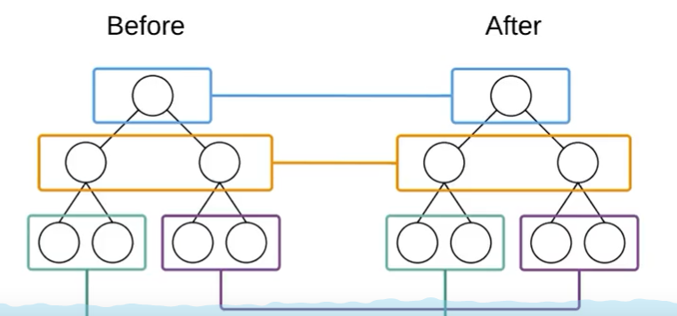

# Vue与React的区别

## 组件化对比


# 虚拟DOM

## 介绍

提供两颗新旧DOM树

- DOM：浏览器中提供的概念。用JS对象表示页面元素，并提供了操作元素的API

- 虚拟DOM：是框架的概念，开发框架的程序员用JS对象来模拟页面上DOM和嵌套关系（本质）
- 目的：为了实现页面元素的按需（高效）更新


# Diff算法

## 介绍

- tree diff：新旧两颗DOM树，逐层对比的过程，当整颗DOM树逐层对比完毕，则所有需要按需要更新的元素必然能被找到
- component diff：在进行Tree Diff的时候，每一层中，组件级别的对比，叫做Component Diff；
  - 如果对比前后，组件的类型相同，则暂时认为此组件下不需要被更新
  - 如果对比前后，组件的类型不同，则需要移除旧组件，创建新组件，并追加到页面上
- element diff：在进行组件对比的时候，如果两个组件类型相同，则需要进行元素级别的对比




# 创建基本的webpack4.x项目

## 步骤

基于Node构建的，支持Node的所有API

约定大于配置，默认打包入口路径为src下的index.js，打包输出文件为./dist/main.js，为了尽量减少配置文件的体积

- npm init -y

- 在项目的根目录创建src源代码目录和dist产品目录

- 在src目录下创建index.html

- cnpm安装webpack，运行cnpm i webpack webpack-cli -D

- webpack.config.js
  
  - mode：development、production
  
- cnpm i webpack-dev-server -D 提升了打包性能，不用每次执行打包命令

- 配置的时候resolve:{

    extensions:['.js','jsx','json'] //表示这几个文件的后缀名可以省略不写

   }


# 在项目中使用React


## 步骤

```javascript
//1.这两个导入时候，接收的成员名称，必须这么写
import React from 'react' //创建组件，虚拟Dom元素，生命周期
import ReactDom from 'react-dom' //把创建好的组件和虚拟Dom放到页面上展示

//2.创建虚拟Dom,即js对象
//参数1：创建元素的类型，是一个字符串，表示元素的名称
//参数2：是一个对象或null，表示当前这个DOM的属性
//参数3：子节点（包括其它虚拟Dom和其它文本子节点）
//参数n：其它子节点
const myH1 = React.createElement('h1',{title:'this is a h1',id:'myh1'},'这是一个大大的H1')
const myDiv = React.createElement('div',null,'这是一个div元素',myH1)

//3.用ReactDom把虚拟Dom渲染到页面
//参数1：要渲染的虚拟Dom元素
//参数2：指定页面上一个容器，第二个参数接受的应该是一个Dom元素，而不是选择器
ReactDom.render(myDiv,document.getElementById('app'))
```

## HTML使用

- 注意：在JS文件中，默认不能写类似于HTML的标记，否则会打包失败
- 可以使用`Babel`来转换这些JS种的标签
- 在js文件中，混合写入类似于HTML语法，叫做`JSX`语法；符合XML规范的JS
- 注意：`JSX语法`的本质还是在运行的时候，被转换成了React.createElement形式来执行的


# JSX语法

## 安装babel

- cnpm i babel-core babel-loader babel-plugin-transform-runtime -D
  - babel-loader比babel-core大一个版本
- cnpm i babel-preset-env babel-preset-stage-0 babel-preset-react -D


## JSX语法使用

- 注意：React中，需要把key添加给forEach或map或for循环直接控制的元素，即最外层的元素


# React中创建组件

## 第一种方法

- 第一种，创建构造函数，首字母必须大写
- 在组件中必须需要返回一个合法的JSX虚拟DOM元素
- Vue和React的props永远都是只读的，不能被重新赋值
- 创建组件
- @符合的路径，表示项目根目录中的src这一层目录
- 如何省略.jsx后缀名
  - 打开webpack.config.js,在导出的配置对象中，新增一个resolve节点

```javascript
resolve:{
    extensions:['.js','.jsx','.json'], //表示这几个文件的后缀名可以省略不写
    alias:{ //表示别名
      '@':path.join(__dirname,'./src')  //这样表示项目根目录中src这层路径
    }
  }
```

```jsx
function Hello(){
	//return null
	return <div>Hello 组件</div>
}
```

- 为组件传递数据

```jsx
//使用组件并为组件床底props数据
<Hello name={dog.name} age={dog.age} gender={dog.gender}</Hello>

//第一种创建组件的方式，为构造函中，使用props形参，接收外界传递的数据
function Hello(props){
return <div>这是一个Hello组件--{props.name}--age{props.age}--gender{props.gender}</div>
}
```


## 第二种方法

使用class关键字来创建组件

ES6中class关键字是实现面向对象的新形式

### 了解ES6中class关键字的基本使用

1. class中`constructor`的基本使用
2. 实例属性和实例方法，new出来的属性为实例属性或实例方法，实例方法挂载在原型上的
3. 静态属性和静态方法，直接挂载给构造函数，以及直接static修饰的属性或方法，静态属性和静态方法放在了constructor里面了
4. 使用`extends`关键字实现继承
5. 注意：在class的{}区间内，只能写构造器、静态方法和静态属性、实例方法
6. class继承中，不写constructor，则默认会有constructor和super继承数据
7. 在class关键字创建组件中，如果想使用外界传递过来的props参数，不需要接收，直接通过**this.props.*****

##### 基于class关键字创建组件

1. 最基本的组件结构：

```jsx
class 组件名称 extends React.Components{
	render(){
		return <div>创建的组件</div>
	}
}
```

- 指定属性默认值

```jsx
Person.defalutProps = {
	sex:'男',
	age:18
}
```

### 两种创建组件方式的对比

> 注意：使用class关键字创建的组件，有自己的私有数据和声明周期函数；
>
> 注意：使用function创建的组件，只有props，没有自己的私有数据和生命周期函数；
>
> props只读不写，this.state可读可写（相当于vue中的data）

1. 用**构造器**创建出来组件：叫做“无状态组件”
2. 用**class关键字**创建出来的组件：叫做“有状态组件”
3. 什么情况使用有状态组件？什么情况使用无状态组件？
   - 如果一个组件需要有自己的私有数据，推荐使用：class创建的有状态组件
   - 如果一个组件不需要私有数据，推荐使用：无状态组件
   - React官方说：无状态组件，由于没有自己的state和生命周期函数，所有运行效率会比有状态组件稍微高一些

> 有无状态组件之间的本质区别就是：有无state属性和有无声明周期函数


# React样式的使用

- 没有模块化，使用**className=“title”**

- css直接导入的样式表在全局生效，即整个项目生效
- css模块化指针对类名和ID生效
  - modules使css样式有模块化
  - 被:global()位置包起来的类名，不会被模块化，而是会全局生效
  - 规定第三方样式表(如**bootstrap**)以.css结尾，不为.css启用模块化
  - 自己的样式表以.scss或.less结尾，启用模块化


- webpack处理图片问题，安装`cnpm i url-loader file-loader -D`


- 引入scss，安装`cnpm i sass-loader node-sass -D`

```javascript
{ test:/\.scss$/,use:['style-loader','css-loader?modules','sass-loader'] }
```


# React中绑定事件的注意点

- 箭头函数本身激素匿名的function函数
- 在React中如果想修改state数据中的值，不要使用this.state.xxx,应该调用React提供的**this.setState({msg:'123'})**方法
- 在setState，只会把对应的state状态更新，而不会覆盖其它的state状态
- this.setState()方法是`异步`的，如果修改完想使用则使用**this.setState({},function(){})**


- input双向数据绑定，给value绑定值后，还要同时提供应该onChange处理函数
  - 在onChange中拿到最新文本框的值
  - 手动调用this.setState({})把最新的值同步到state中


# ref获取Dom元素

- 改变文本框的值


# 组件的生命周期

