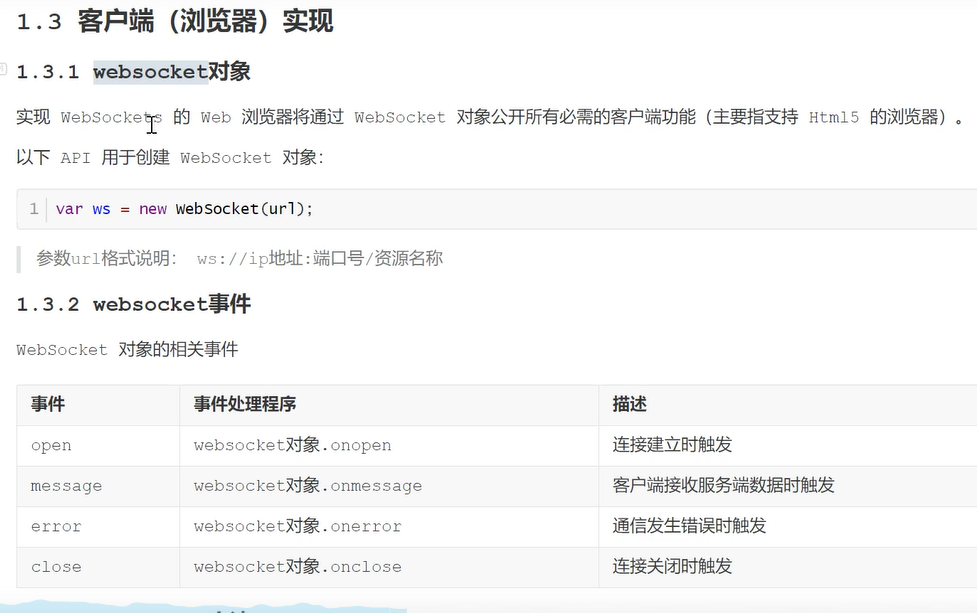
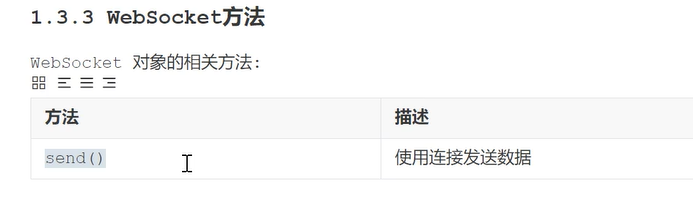

# Socket.IO

Socket.IO是一个库，可用于在浏览器和服务器之间进行实时，双向和基于事件的同学。它包括：

- 使用Node.js服务器
- 为浏览器（可从Node.js的也运行）一个JavaScript客户端库

## 安装

### 服务器

```shell
npm install --save socket.io
```

### Javascript客户端

```shell
npm install --save socket.io-client
```

## 与Node http服务器一起使用

### 服务器（app.js）

```javascript
var app = require('http').createServer(handler)
//解决vue3跨域问题
var io = require('socket.io')(app,{
  cors: {
    origin: "*",
    methods: ["GET", "POST"]
  }
})
var fs = require('fs')

app.listen(80)

function handler(req,res){
  fs.readFile(__dirname + '/index.html',function(err,data){
    if(err){
      res.writeHead(500)
      return res.end('Error loading index.html')
    }
    res.writeHead(200)
    res.end(data)
  })
}

io.on('connection',function(socket){
  socket.emit('news',{hello:'world'})
  scoket.on('my other event',function(data){
    console.log(data)
  })
})
```

### 客户端（index.html）

```javascript
<script src="js/socket.js"></script>
<script>
  var socket = io('http://localhost')
  socket.on('news',function(data){
    console.log(data)
    socket.emit('my other event',{my:'data'})
  })
</script>
```


# webSocket

## 客户端

- 安装`npm i -S websocket-heartbeat-js@1.0.8`
- 导入

```javascript
import WebSocket from "websocket-heartbeat-js";
```

- 执行

父组件

```javascript
mounted() {
    //自适应柱状图
    window.onresize = () => {
      this.$refs.barEcharts.resize();
    };
  },
initWebsocket() {
        let websocket = new websocketJs({
            url: env.websocket + "DailySalesReport",
            pingTimeout: 15000, 
            pongTimeout: 90000, 
            reconnectTimeout: 2000
        });
        websocket.onopen = event => {
            console.log("WebSocket连接成功");
        };
        websocket.send = () => {};
        websocket.onerror = () => {
            console.log("WebSocket连接发生错误");
        };
        websocket.onclose = () => {
            console.log("WebSocket连接关闭");
        };
        window.onbeforeunload = () => {
            websocket.close();
        };
        websocket.onmessage = response => {
            let data = JSON.parse(response.data);
            switch (data.type) {
                case "GF_Report":
                    this.lineData = data.value;
                    break;
                case "GNALL_Report":
                    this.barHData = data.value;
            }
        }
    }
},
created() {
    this.initWebsocket();
}
```

子组件调用

```javascript
props: {
    barHData: {
      type: Array,
    },
  },
  data() {
    return {
      // Echarts数据
      myChart: {},
    };
  },
  mounted() {
    this.initEcharts();
    this.setEchartsData();
  },
  methods: {
    //Echarts自适应
    resize() {
      this.myChart.resize();
    },
    // 基于准备好的dom，初始化echarts实例
    initEcharts() {
      this.myChart = echarts.init(this.$refs.charts);
    },
    //设置Echarts数据
    setEchartsData() {
      this.myChart.setOption({
        grid: {
          top: "0",
          left: "80",
          right: "50",
          bottom: "0",
        },
        calculable: true,
        xAxis: [
          {
            type: "value",
            axisLine: {
              show: false,
            },
            axisLabel: {
              show: false,
            },
            splitLine: {
              show: false,
            },
          },
        ],
        yAxis: [
          {
            type: "category",
            data: [],
            axisLine: {
              show: false,
            },
            axisLabel: {
              show: true,
              textStyle: {
                fontSize: 12,
                color: "#90AECB",
              },
            },
            splitLine: {
              show: false,
            },
          },
        ],
        series: [
          {
            type: "bar",
            barWidth: 12,
            itemStyle: {
              normal: {
                color: new echarts.graphic.LinearGradient(
                  1,
                  0,
                  0,
                  0, // 0,0,1,0表示从左向右    0,0,0,1表示从右向左
                  [
                    { offset: 1, color: "#5B51BB" },
                    { offset: 0, color: "#98ABDD" },
                  ]
                ),
                label: {
                  show: true,
                  position: "right",
                  distance: 10,
                  fontSize: 12,
                  color: "#90AECB",
                },
              },
            },
            data: [],
          },
        ],
      });
    },
  },
  watch: {
    barHData(newVal) {
      let name = [];
      let quantity = [];
      newVal.forEach((item) => {
        name.unshift(item.name);
        let value = item.value / 10000;
        quantity.unshift(value.toFixed(2));
      });
      this.myChart.setOption({
        yAxis: {
          data: name,
        },
        series: [
          {
            data: quantity,
          },
        ],
      });
    },
  },
```

jav



## 服务端

