# TypeScript

- JS可以运行在浏览器和node.js

- TS是JavaScript的超集，为JS添加了类型系统
- TS是微软开发的开源编程语言，设计目标是开发大型应用

优点：

1. 类型化思维方式，使得开发更加严谨，提前发现错误，减少改Bug时间
2. 类型系统提高了代码可读性，并使维护和重构代码更加容易
3. 补充了接口、枚举等开发大型应用时JS缺失的功能


# 开发工具

## VScode

- VScode安装时勾选三个勾
- vscode安装中文汉化插件：`Chinese （simplified）`

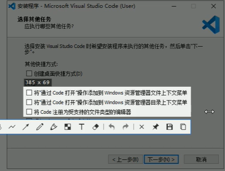

## Node.js

- 傻瓜式安装
- 验证node是否安装：`node --version`

## 安装解析TS的工具包

### TSC

- 安装步骤：`npm i -g typescript`

- typescript：就是用来解析TS的工具包，提供了`tsc`命令，实现了TS->JS的转化


# TS

- TS代码能直接在Node.js里面运行嘛？不能
- 该如何处理呢？ TS代码->JS代码   执行JS

## 执行步骤

- `tsc hello.ts`会解析生成一个hello.js文件
- `node hello.js`执行js文件

## 简化执行TS的步骤

- 使用ts-node包可直接在Node.js中执行TS代码
- ts-node包内部偷偷的将TS->JS，然后执行JS代码
- 全局安装：`npm i -g ts-node`
- 使用方式：`ts-node hello.ts`


# 变量

1. 变量名称只能出现：数字、字母、下划线、$，并且不能以数字开头
2. 变量的名称是区分大小写的

声明变量并指定类型，后给变量赋值

- let age: number；     //number为类型注解
- age = 18

声明的时候初始化

- let age: number = 18

> 特殊：变量不要命名为name
>
> 类型注解：是一种为变量添加类型约束的方式，约定了什么类型，就只能给变量赋什么类型的值


# 算术运算符

- 除了`+`以外，其他算术运算符（-、*、/）必须是数字类型


# 调试ts代码

配置

```json
{
  "version": "0.2.0",
  "configurations": [
    {
      "type": "node",
      "request": "launch",
      "name": "调试TS代码",
        //调试时可以运行ts代码
      "runtimeArgs": ["-r","ts-node/register"],
        //要调试的文件
      "args": ["${workspaceFolder}/a.ts"]
    }
  ]
}
```

安装包：调试时只认识当前目录的包

- `npm i ts-node typescript`


# 数组

- 类型+[]，数组的类型必须相同
  - let names: string[] = []
- 添加元素的通用写法：数组名称[数组长度] = 新值
- for循环：i<arr.length


# 函数

- 函数的形参也要指定类型nums: number[]
- 指定函数返回值类型:return的返回值类型要与函数的类型必须相同
  - function getSum(nums :number[]): number{}
- 如果没有return，默认返回值类型为void类型
- return只能在函数内部使用


# 对象的类型注解

- 对象类型注解的语法类似于对象自身的语法
- 建立一种契约，约束对象的结构

```javascript
let person:{                        person={
  name:string;                           name:'刘老师',
  age:number;                            age:18
}                                     }
//方法
let p2:{
    sing:(name: string)=>void
}
p2  = {
    sing:function (name: string){
        console.log('歌曲名称:'+name)
    }
}
```

> 键值对中的值是类型
>
> 多个键值对之间使用分号分隔，并且分号可省略


# 接口

直接在对象名称后面写类型注解的坏处：

1. 代码结构不简洁
2. 无法复用类型注解

接口：为对象的类型注解命名，并为你的代码建立契约来约束对象的结构

- 接口的名称约定以`I`开头
- 推荐：使用接口来的作为对象的类型注解

```typescript
interface IUser{
  name:string
  age:number
  sayHi:()=>void
}
```

```typescript
let p1:IUser = {
  name:'jack',
  age:18,
  sayHi:function(){
      console.log('再见杰克')
  }
}
```


# 类型推论

某些没有明确指出类型的地方，类型推论会帮助提供类型

- 声明变量并初始化，可以省略类型注解

- 决定函数返回值时也可以省略类型注解

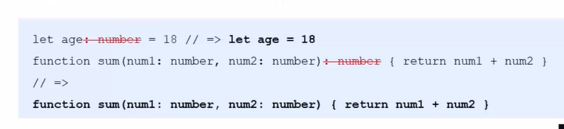


# 浏览器中运行TS

- 使用tsc命令的监视模式`tsc --watch index.ts`
- --watch 表示启用监视模式，只要重新保存了ts文件，就会自动调用tsc将ts转化为js


# 类型断言

手动指定更加具体的类型，当你比TS更了解某个值的类型，并且需要指定更具体的类型

- Element类型只包含所有元素共有的属性和方法（比如：id属性）
- 通过获取Dom，只能拿id，拿其它的属性报错

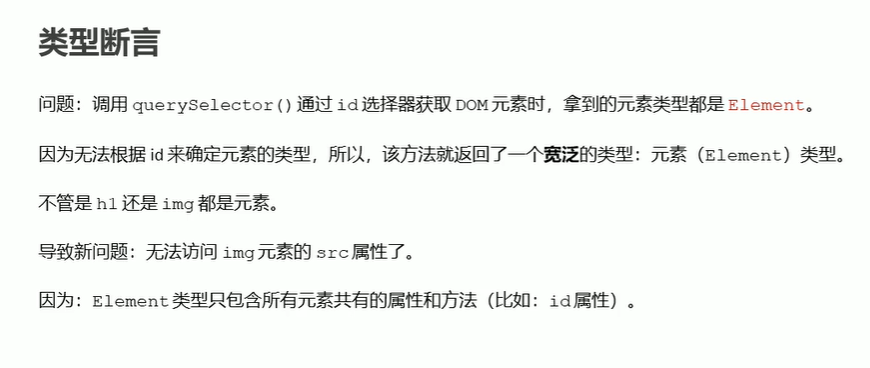

- 需要拿到img的src属性，则需要将而类型具体指定为 HTMLImageElement
- 通过console.dir()打印元素类型，通过看prototype可以看到元素的类型

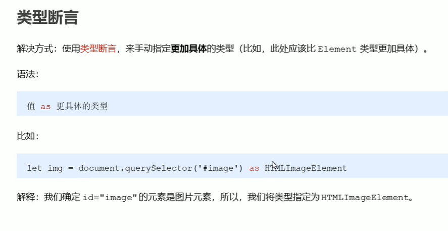

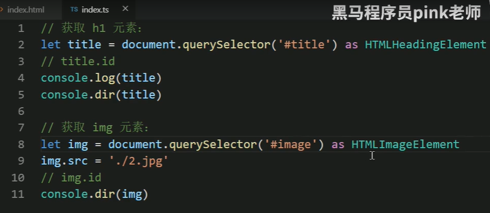

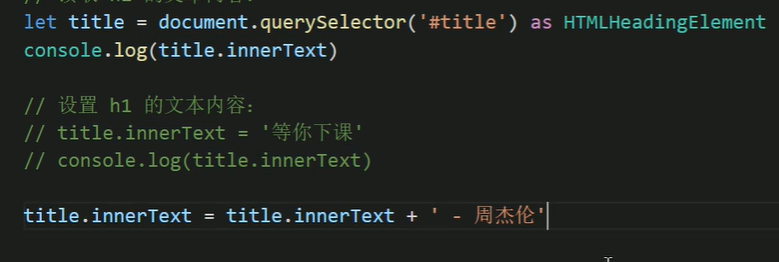


# 操作样式

添加类名

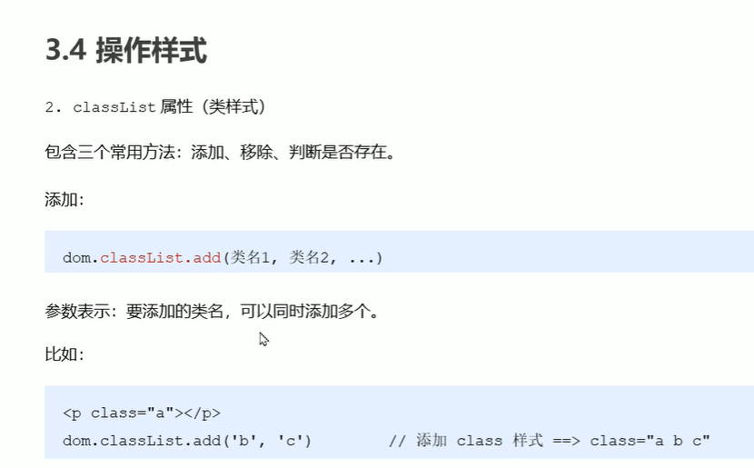

移除类名

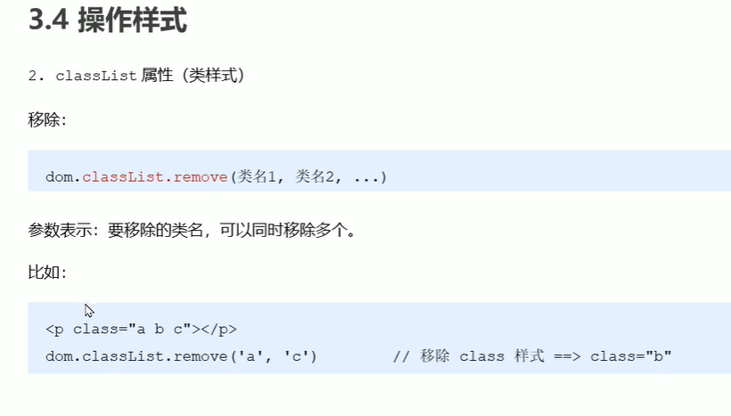

判断类名是否存在

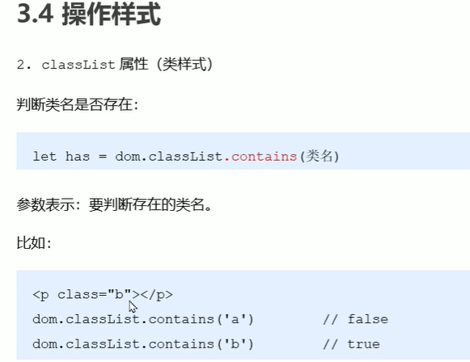


# 操作事件

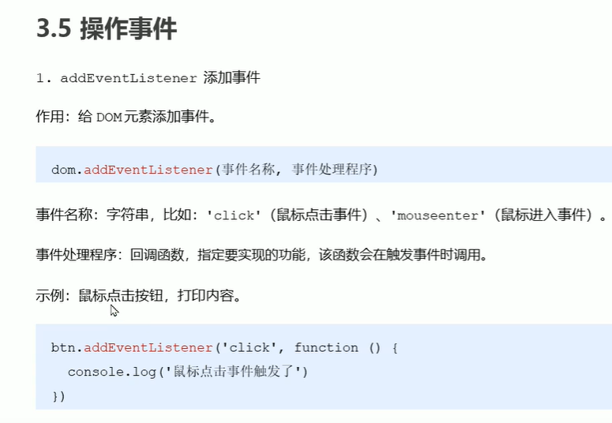

## 事件对象

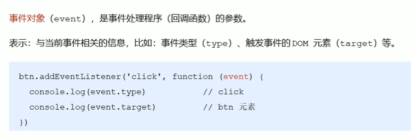

事件对象：函数声明时要指定类型注解，匿名（回调）函数不用

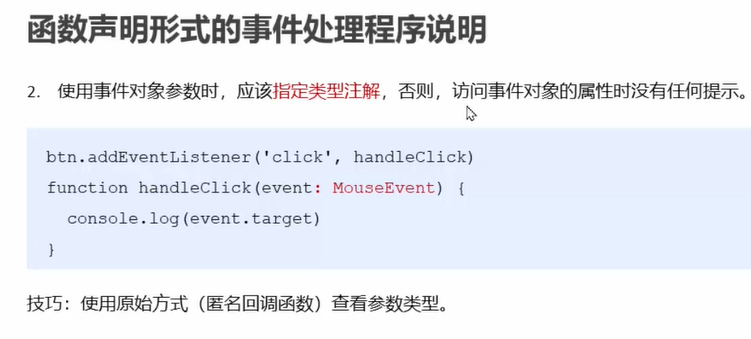

## 移除事件

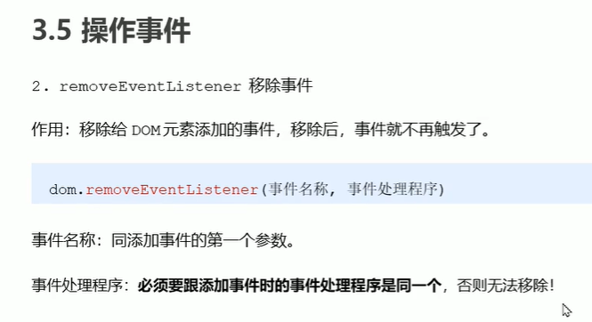

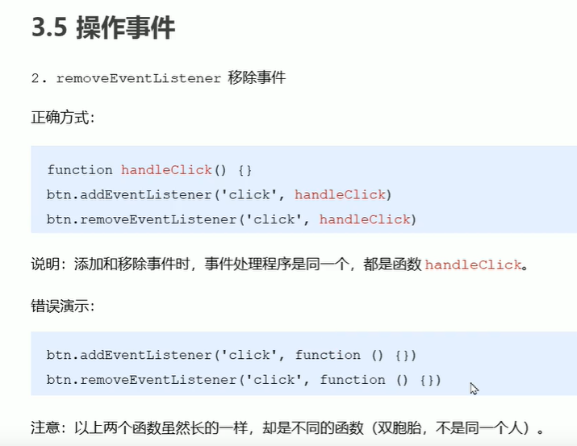

## 只触发一次

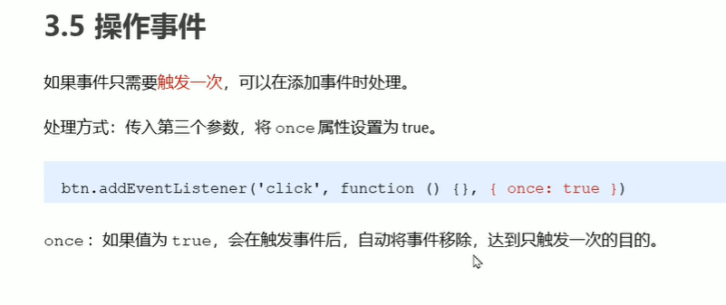

## 函数声明的事件说明

函数声明会有提升

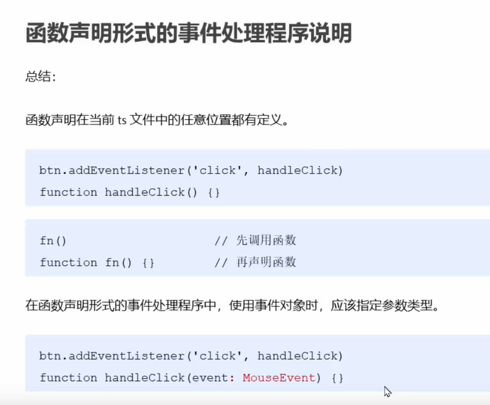