# Webpack

webpack是一个现代的JavaScript应用的静态模化块打包工具。

- 模块，核心：让我们可能进行模块化开发，并处理模块间的依赖关系
- 打包，合并压缩
- webpack模块化打包，webpack为了可以正常运行，必须依赖node环境，node环境为了可以正常的执行很多代码，必须依赖各种依赖的包，npm工具（node packages manager）管理各种依赖的包

## Webpack安装

- 安装nod0.jse，node.js自带了软件包管理工具npm
- 安装webpack，npm install webpack@3.6.0 -g

## Webpack的使用

- src文件夹，放源码，开发用的

- dist，打包的代码放入dist中

## 与grunt/gulp的对比

- grunt/gulp被称为前端自动化任务管理工具，没有用到模块化
- 将ES6，ts转化，图片压缩，scss转成css

## common.js

导出

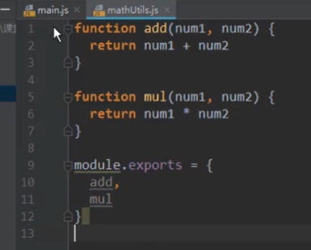

导入

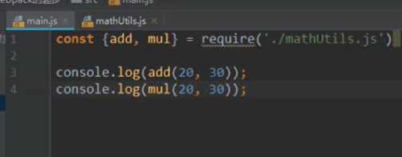

终端中打包，打包成浏览器能识别的代码

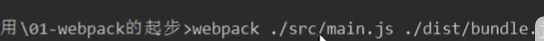

页面导入打包的那个js

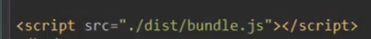

## es6导入导出

导出

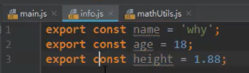

导入import from

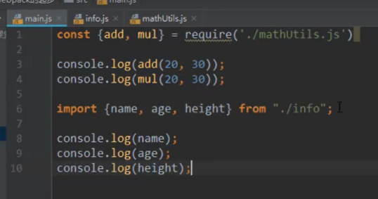

写完后终端再次打包，上箭头回车

## webpack配置

- 在项目中创建webpack.config.js和package.json
- entry入口，output出口，path路径为绝对路径，动态的获取路径

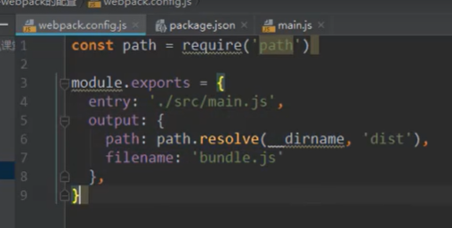

- 建好package.json
  - 执行命令，初始化node,  npm init

  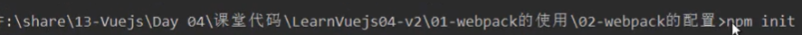

  - 起名字

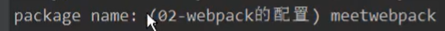

- 终端执行webpack回车

- 局部安装webpack，使webpack和npm run build映射，npm run build 和webpack相等

  - 配置脚本文件，加个build，就能执行npm run build

  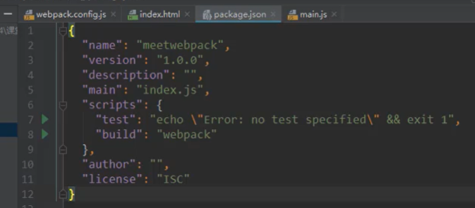

- 配置开发依赖，本地安装webpack

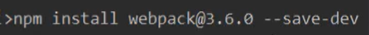

## loader

css依赖

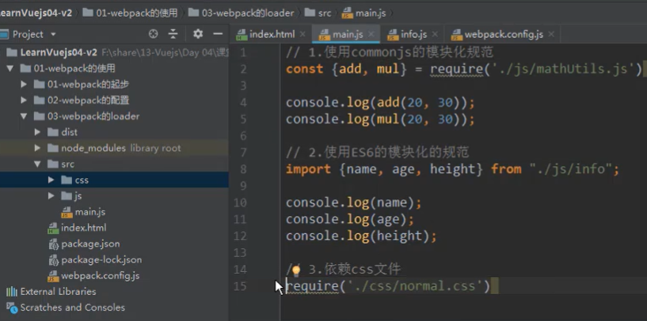

在终端执行npm run build

- 使用
  - 