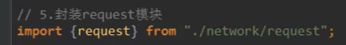

# 网络请求axios

- 是一个基于Promise用于浏览器和node.js的HTTP客户端，HTTP客户端即为可以调用一个HTTP的一个后台接口
- 支持浏览器和node.js
- 支持promise
- 能拦截请求和响应
- 自动转换JSON数据

## ES7封装请求

- $http名字自定义的，main.js中
- params是个对象，传的是参数


```javascript
// 配置请求的根路径
axios.defaults.baseURL='http://timemeetyou.com:8889/api/private/v1/'
axios.interceptors.request.use(config=>{
  console.log(config)
  config.headers.Authorization=window.sessionStorage.getItem('token');
  return config
})
Vue.prototype.$http=axios

Vue.config.productionTip = false
```

put请求，修改请求参数

```javascript
// 开关状态
    async userStateChanged(userInfo) {
      console.log(userInfo)
      const { data: res } = await this.$http.put(
        `users/${userInfo.id}/state/${userInfo.mg_state}`
      )
      console.log(res)
      this.$message.success('更新用户成功！')
    },
```

```javascript
// 开关状态
    async userStateChanged(userInfo) {
      console.log(userInfo)
      const { data: res } = await this.$http.put(
        `users/${userInfo.id}/state/${userInfo.mg_state}`
      )
      console.log(res)
      this.$message.success('更新用户成功！')
    },
```

```javascript
async getUserList(){
      const {data:res} = await this.$http.get('user_list',{params:{page:this.page,size :5}});
      // console.log(res);
      this.userlist=res.data.users.records;
    },
```

get请求

```javascript
async showEditDialog(id) {
      const { data: res } = await this.$http.get('users/' + id);
      this.editForm=res.data;
      this.editDialogVisible = true
      console.log(id)
    },
```

```javascript
async getUserList() {
      const { data: res } = await this.$http.get('users', {
        params: this.queryInfo,
      })
```

post请求

```javascript
// 点击确定按钮，添加新用户
    addUser() {
      this.$refs.addFormRef.validate(async (valid) => {
        console.log(valid)
        if (!valid) return
        // 添加用户的请求
        const { data: res } = await this.$http.post('users', this.addForm)
        // console.log(res)
        if (res.meta.status !== 201) {
          this.$message.err('添加用户失败！')
        }
        this.$message.success('添加用户成功！')
        this.addDialogVisible = false
        this.getUserList()
      })
    },
```


## 请求方式

- get对应的请求参数是params：{}
- post对应的请求参数是data：{}


## 并发请求

- axios.all([]).then()

- axios.spread(res1,res2)接受数据


## 全局配置

```javascript
// 配置请求的根路径
axios.defaults.baseURL='http://timemeetyou.com:8889/api/private/v1/'
//请求超时时间
axios.defaults.timeout = 5
```


## 步骤

- 封装


- 导入



- 调用


## 拦截器


- 请求拦截器，必须要return config和err


- 请求拦截作用，比如设置请求头


- 给所有的请求配置token


- 响应拦截器，比如用于获取后台所需要的数据


- 响应获取我们所需要的的后台data数据，通过res.data获取


## 基本用法

- axios自动把json形式的数据进行了转化，不用处理后台传过来的json数据了

- 传统形式的url即？形式的，node中通过req.query.id,id为key
- 在node中，url地址通过冒号来接受，通过req.params.id来获取对应的参数

- get请求和delete请求的restful形式的url ，即/形式的，通过req.query.id来获取对应的参数，post请求和put请求的restful，在node中用req.body来接受传参数据
- 前端axios有params的，node中用req.query来接受参数
- get和delete都需要params来传参数
- 


- node以json形式响应给前端，通过res.json


## 全局配置


node解决token跨域问题


## async/await

- await后面跟着的是promise实例对象

- 它所return的数据依然是promise实例，通过.then方法依然可以获取到return的数据

- 处理多个异步请求

